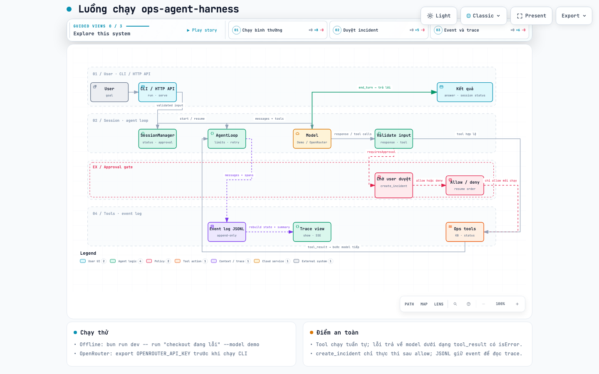

# Ops Agent Harness

A small operations assistant that takes a task, asks an LLM to use tools, validates each step, and saves a trace you can inspect later. It includes three mock tools and supports both a command-line interface and an HTTP API.

## Quick start: offline demo

Requirements: [Bun](https://bun.sh/) and Node.js 22 or newer.

```bash
bun install
bun run dev -- run "Check checkout health" --model demo
```

The demo runs locally. It does not need an API key or internet access. It recognizes the mock services `checkout`, `payments`, and `search` in your objective. Checkout is seeded as operational; payments is degraded; search is in outage.

To see the approval flow and create a mock incident automatically:

```bash
bun run dev -- run "Investigate payments" --model demo --approve allow
```

The command prints a session ID and a final answer. Events are stored as JSONL files under `.ops-agent-harness/` in the current directory.

## Use OpenRouter

The CLI uses OpenRouter by default. Copy the example environment file and add your own API key:

```bash
cp .env.example .env
```

Set `OPENROUTER_API_KEY` in `.env`, then run:

```bash
bun run dev -- run "Check checkout health" --model openrouter
```

The default model is `deepseek/deepseek-v4.1-flash`. You can choose another OpenRouter model with `--model-id`; otherwise the model is selected from `OPENROUTER_MODEL`, then the default above.

```bash
bun run dev -- run "Investigate payments" --model openrouter --model-id "deepseek/deepseek-v4.1-flash"
```

Never add a real API key to source code or commit it. The offline `--model demo` option does not use this key.

## Approval behavior

`create_incident` is the only mock tool that changes state, so it requires approval before it runs. Choose an approval mode explicitly:

```bash
# Ask in an interactive terminal
bun run dev -- run "Investigate payments"  --model openrouter --model-id "deepseek/deepseek-v4.1-flash"   --approve prompt

# Approve automatically
bun run dev -- run "Investigate payments" --model openrouter --model-id "deepseek/deepseek-v4.1-flash" --approve allow

# Deny automatically
bun run dev -- run "Investigate payments" --model openrouter --model-id "deepseek/deepseek-v4.1-flash" --approve deny
```

In a non-interactive environment, the default policy is deny. A denied incident is not created; the assistant reports the denial.

## CLI commands

```bash
# Run the  demo
bun run dev -- run "Check checkout health" --model openrouter --model-id "deepseek/deepseek-v4.1-flash" 

# Limit model steps; this run should stop at the limit
bun run dev -- run "Check checkout health" --model openrouter --model-id "deepseek/deepseek-v4.1-flash"  --max-steps 1

# View the session summary and event trace
bun run dev -- show <SESSION_ID>
bun run dev -- trace <SESSION_ID>

# Print the raw JSONL events
bun run dev -- trace <SESSION_ID> --json
```

`run` exits with code `0` when the session completes and `2` when it fails. Useful options include `--model-id`, `--max-steps`, `--timeout-ms`, and `--data-dir`.

## HTTP API

Start the API server. OpenRouter-backed sessions need `OPENROUTER_API_KEY` in `.env` or the process environment.

```bash
bun run dev -- serve --host 127.0.0.1 --port 8787
```

Create a session. The API returns immediately with `queued`; the model run continues in the background.

```bash
curl -s http://127.0.0.1:8787/sessions \
  -H 'content-type: application/json' \
  -d '{"objective":"Investigate payments","modelId":"deepseek/deepseek-v4.1-flash"}'
```

Common endpoints:

```text
GET  /healthz
GET  /metrics
POST /sessions
GET  /sessions/:id
GET  /sessions/:id/events?after_seq=0
GET  /sessions/:id/events/stream       # SSE; resume with Last-Event-ID
POST /sessions/:id/approvals
POST /sessions/:id/interrupt
```

If a session is waiting for approval, find its `tool_use_id` in the session or events response and submit a decision:

```bash
curl -s http://127.0.0.1:8787/sessions/<SESSION_ID>/approvals \
  -H 'content-type: application/json' \
  -d '{"tool_use_id":"<TOOL_USE_ID>","result":"allow"}'
```

Read events directly or resume the SSE stream:

```bash
curl -s 'http://127.0.0.1:8787/sessions/<SESSION_ID>/events?after_seq=0'
curl -N http://127.0.0.1:8787/sessions/<SESSION_ID>/events/stream \
  -H 'Last-Event-ID: 0'
```


Start the API server first. Set the collection's `baseUrl` variable if your server uses a different address. Creating a session through the API calls OpenRouter, so the server process needs `OPENROUTER_API_KEY`.

## How it works



Open the [interactive workflow diagram](assets/ops-agent-flow.html) to zoom, search nodes, switch themes, and follow the workflow. The diagram source is [ops-agent-flow.workflow.json](assets/ops-agent-flow.workflow.json).

In short: the CLI or API validates a request and creates a session. `SessionManager` records events and starts `AgentLoop`. The loop builds conversation history from the event log, calls `DemoModel` or `OpenRouterModel`, validates the response, checks tool inputs, and runs tools in order. Tool results go back to the model. If `create_incident` needs approval, the session pauses before the incident is created and resumes after an allow/deny decision.

### Session lifecycle

```text
queued → running → completed       (the model finishes its turn)
                 → failed           (a limit or error stops the run)
                 → requires_action  (a tool needs approval)
                   → running        (all approval decisions are recorded)
running → paused → running          (recovered after a crash)
running → completed                 (interrupted; stopReason = interrupted)
```

Session status is rebuilt from the event log. An interrupt ends with status `completed` and `stopReason: interrupted`. A session remains `requires_action` until all pending approval decisions are recorded.

## Mock tools and data

- `search_knowledge_base` searches seven sample runbook entries using simple word matching.
- `get_service_status` returns seeded status data for checkout, payments, and search.
- `create_incident` writes to a local in-memory store, requires approval, and deduplicates retries.

These tools demonstrate the harness. They are not connected to real monitoring, documentation, or incident-management systems.


## Environment variables

| Variable | Purpose | Default/example |
|---|---|---|
| `OPENROUTER_API_KEY` | API key required for OpenRouter-backed model calls. | Set your own key. |
| `OPENROUTER_MODEL` | OpenRouter model used unless overridden by the request or CLI. | `deepseek/deepseek-v4.1-flash` |

